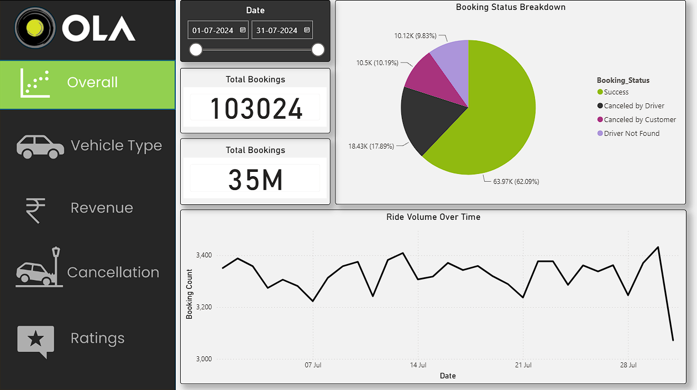
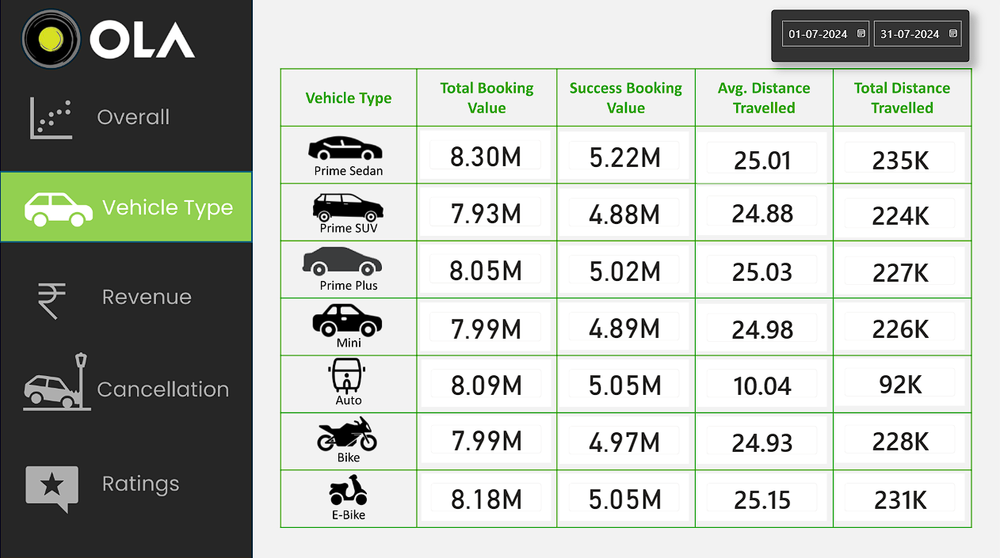
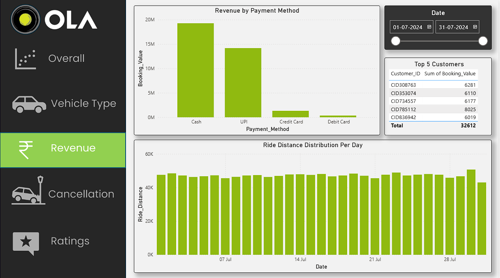
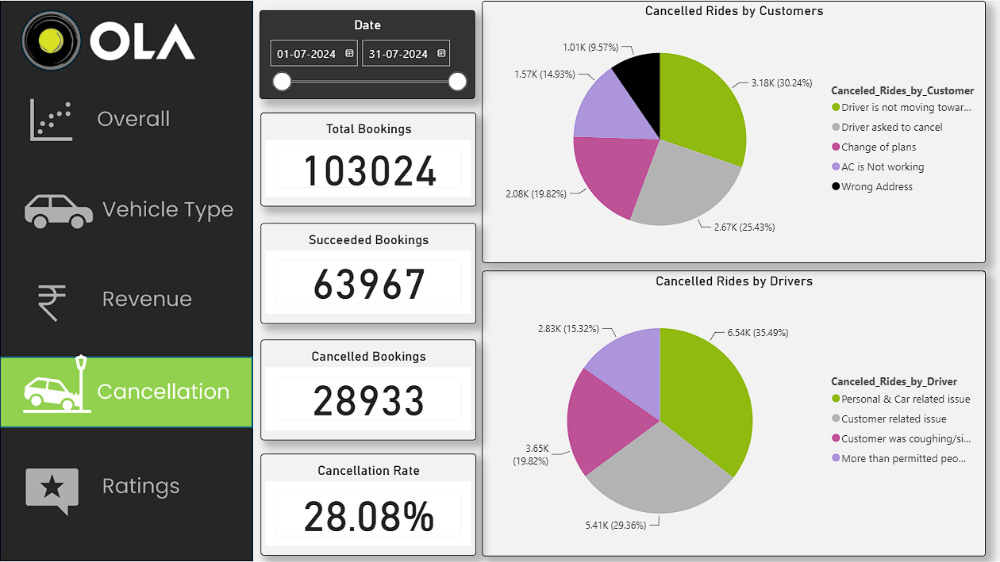
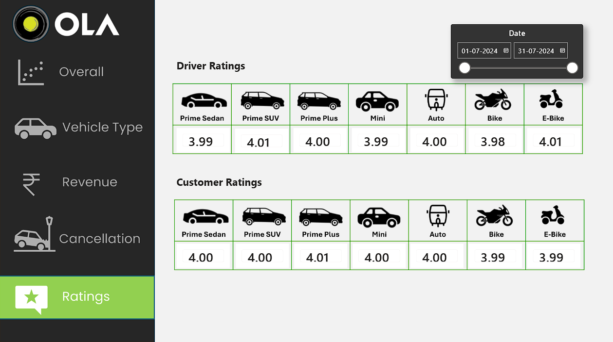

# 🚖 OLA Ride Analytics Dashboard

> End-to-end ride-hailing analytics using SQL and Power BI on 103K+ OLA bookings from July 2024.

---

## 🎯 Objective

Analyze one month of OLA ride data to surface cancellation patterns, revenue trends, vehicle performance, and rating behavior across 103,024 bookings.

---

## 📋 Overview

This project answers 10 real SQL business questions and presents insights across 5 Power BI dashboard views: Overall, Vehicle Type, Revenue, Cancellation, and Ratings. The dataset was generated using ChatGPT prompts to simulate realistic OLA ride records, then cleaned and analyzed end-to-end.

---

## ❓ Problem Statement

OLA generates massive daily ride data but raw numbers alone don't answer business questions. This project addresses:

- Why are rides getting cancelled, and by whom?
- Which vehicle types generate the most revenue?
- How are drivers and customers rating each other?
- What payment methods do customers prefer?

---

## 📂 Dataset

| Field | Details |
|---|---|
| 🔧 Source | AI-generated dataset (ChatGPT prompt-based simulation) |
| 📅 Period | 01-07-2024 to 31-07-2024 |
| 📊 Total Records | 103,024 bookings |
| 🗂️ Total Columns | 19 |
| 🔑 Key Columns | Booking_Status, Vehicle_Type, Payment_Method, Ride_Distance, Booking_Value, Driver_Ratings, Customer_Rating, Cancelled_Rides_by_Customer, Cancelled_Rides_by_Driver, Incomplete_Rides |

> **Note:** Data was AI-generated via ChatGPT to simulate a real-world OLA booking environment for analytical purposes.

---

## 🛠️ Tools and Technologies

| Tool | Purpose |
|---|---|
| 🐬 MySQL | Data storage, querying, SQL view creation |
| 📊 Power BI | Dashboard design and visualization |
| ⚡ Power Query | Data transformation and shaping inside Power BI |
| 📐 DAX | Custom measures and calculated columns |
| 📁 Microsoft Excel | Data cleaning: removed duplicates, filled null values with 0 |

---

## ⚙️ Methods

1. Generated dataset using ChatGPT with structured prompts to simulate OLA booking records
2. Cleaned raw data in Excel: removed duplicates, filled null values with 0
3. Created a MySQL database `Ola` and loaded the bookings table
4. Wrote 10 SQL queries covering aggregations, filters, and GROUP BY logic
5. Created SQL Views for each query to simplify Power BI data import
6. Used Power Query inside Power BI for further data shaping and type corrections
7. Built DAX measures for KPIs: Cancellation Rate, Total Booking Value, Success Booking Value
8. Built 5 report pages with slicers, pie charts, bar charts, line charts, and tables
9. Applied date-range slicers across all pages for dynamic filtering

---

## 💡 Key Insights

- **62.09%** of bookings completed successfully; **28.08% cancellation rate** is a red flag
- **Cash dominates** payment at ~19M booking value; UPI is second at ~13M
- **Prime Sedan** leads in total booking value (8.30M) with avg distance of 25.01 km
- **Auto has the shortest avg distance** (10.04 km) and lowest total distance (92K), confirming short-trip usage
- Top customer cancellation reason: **"Driver is not moving towards pickup"** at 30.24%
- Top driver cancellation reason: **"Personal & Car related issue"** at 35.49%
- Driver and customer ratings tightly cluster between **3.98 and 4.01** across all vehicle types, showing rating compression
- Top 5 customers by booking value total **32,612**, useful for loyalty targeting

---

## 📸 Dashboard Views

### 1. Overall

> Booking Status Breakdown (pie), Ride Volume Over Time (line), Total Bookings and Total Revenue KPIs

---

### 2. Vehicle Type

> Comparison table: Total Booking Value, Success Booking Value, Avg Distance Travelled, Total Distance Travelled across 7 vehicle types

---

### 3. Revenue

> Revenue by Payment Method (bar), Top 5 Customers by Booking Value (table), Ride Distance Distribution Per Day (bar)

---

### 4. Cancellation

> Cancelled Rides by Customer (pie), Cancelled Rides by Driver (pie), Cancellation Rate KPI (28.08%)

---

### 5. Ratings

> Driver Ratings by Vehicle Type (table), Customer Ratings by Vehicle Type (table)

---

## ▶️ How to Run This Project

**SQL Setup:**
```sql
CREATE DATABASE Ola;
USE Ola;
-- Import bookings.csv into the bookings table
-- Run all 10 CREATE VIEW statements from the SQL file
```

**Power BI Setup:**
1. Open the `.pbix` file in Power BI Desktop
2. Update the MySQL connection string to your local host
3. Refresh the dataset
4. Use the date slicer on each page to filter by date range

---

## ✅ Results and Conclusion

The dashboard surfaces a **28.08% cancellation rate** as the single biggest operational issue. Driver-side cancellations (35.49% personal/car issues) point to fleet reliability problems. Customer-side cancellations (30.24% driver not moving) suggest GPS or dispatch delays. Revenue skews heavily toward **Cash and UPI**; card adoption stays low. All vehicle types show near-identical ratings (~4.00), which signals the rating system needs redesign to surface real performance differences.

---

## 🔮 Future Work

- Integrate real-time data pipeline using Python + MySQL
- Add predictive cancellation model using logistic regression
- Build a surge pricing analysis by time of day and pickup location
- Expand dataset to multi-city, multi-month analysis
- Deploy dashboard to Power BI Service for shared team access

---

## 👤 Author and Contact

**Gulfam Raza**
B.Tech – Information Technology, RKGIT Ghaziabad

🎓 CGPA: 8.02 | First Division with Distinction

Specialisation: Data Analytics & its related roles.
- 💼 LinkedIn: [linkedin.com/in/your-profile](https://www.linkedin.com/in/gulfamraza1)
- 📧 Email: razagulfam0786@gmail.com
- 📞 Mobile no: +916395528887

---

⭐ If this project helped you, give it a star on GitHub!
